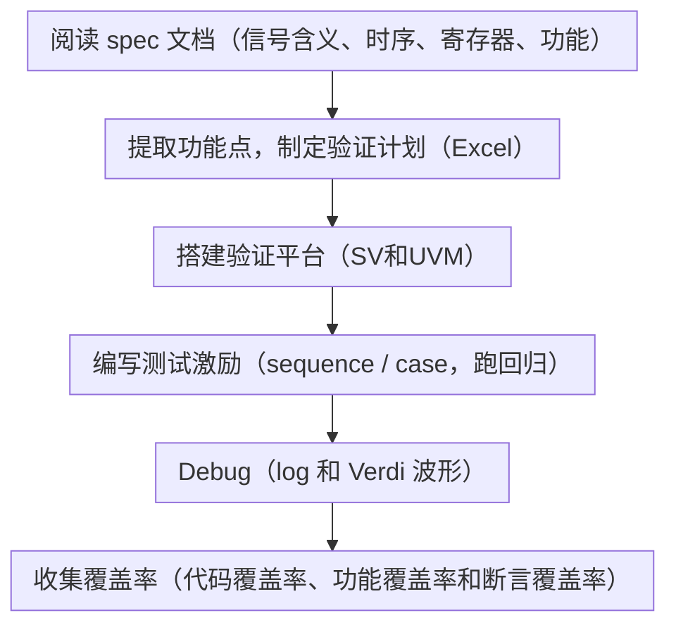

# SV 学习笔记

必看的SV学习书籍：SystemVerilog 验证测试平台编写指南 [美] 克里斯·斯皮尔

## SV概括

### 数字IC验证的目的

>1. 简单来说，就是**寻找漏洞**；
>2. 确保设备能够成功地完成预定的任务、预期的功能可以完整的实现!

### IC验证的流程

Debug：在log文件中通过` UVM error` 找到对应时间点，从Verdi波形体现，再返回RTL代码；
覆盖率：
1. 代码覆盖率——RTL代码所便利的行数或列数（翻转覆盖率、行覆盖率等详见“SV测试编写指南第九章”）；
2. cover group -> cover point -> beans（反应覆盖率到达多少）。

### SV的优势

1. 受约束的随机激励生成；***random constraint***
2. 功能覆盖率；***coverage***
3. 更高层次的结构，尤其是面向对象的编程；***class***
4. 多线程及线程间的通信；`begin...end fork...join/join_any/join_none event semaphore mailbox`（fork...join）[[event 和 mailbox]]
5. 支持HDL数据类型，例如Verilog的四状态数值； ***0 1 X Z***
6. 集成了事件仿真器，便于对设计施加控制。

### 数字IC验证的评价标准

>**第一准则**:能够100%确保被测对象（DUT）符合Spec.规定的功能及其性能，即验证的完备性；

测试过程中用“测试覆盖率”数据来定量分析测试的进程

### 验证环境的层级

> 1.Transaction and Signal Layer
> - Driver：把一个简单的transaction[^1]描述转换成PIN level的信号交互；
> - Monitor：把PIN[^2] level的信号交互转换成一个简单的transaction描述；
> - Assertions：检查DUT IO和内部信号的波形是否正确；
> 
> 2.Function Layer
> - Sequence：生成稍复杂的某项功能指令描述，实现该功能可能需要拆分成多个transaction，并发送给Driver；
> - Scoreboard：参考模型所在地。接收功能指令描述，产生Spec.规定的预期输出；
> - Checker:对比DUT与scoreboard的输出transaction,检查DUT功能是否正确;
>
> 3.Scenario Layer（实际应用场景级）
> - Scenario的例子：一个视频处理SOC可能处于：视频采集与回访模式，视频采集与压缩并SD存储模式，特定视频帧抓取与SD存储模式；
> - Generator：根据某个应用场景，产生多个功能指令描述（或多个Sequence）；
>
> 4.Test Layer
> - Test：决定测试哪种应用场景；
> - Function Coverage：收集测试过程中b已经覆盖了哪些Spec.规定的测试功能点；

[^1]:`transaction`将一组有逻辑关联的引脚级操作封装成一个高层数据对象。例如一次总线读写、一个网络包、一条指令。用 `class`定义，包含数据属性（地址、数据、命令）和可能的约束。
[^2]:`PIN level`是最底层的抽象，直接操作DUT的每个具体信号（`clk`、`rst`、`addr`、`data`、`valid`等）。

### SV新增的验证特性

- 更丰富的数据类型：字符串，动态数组，队列，哈希数组；
- 面向对象编程：class定义；
- Constrained randomize：约束随机数生成；
- 进程间的通信机制：semaphore，mailbox，event；
- Function coverage的描述与覆盖率收集；
- 编程语言交互接口：DPI；
- 断言：assertion；
